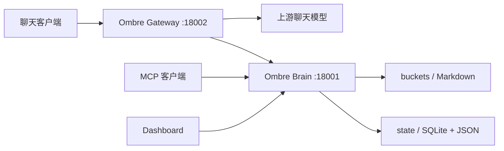

# Ombre Brain — Haven/Rain Fork

Ombre Brain 是一套以 Markdown 记忆桶为长期真源、同时提供 MCP 与聊天 Gateway 的个人连续性系统。

本仓库基于 [P0luz/Ombre-Brain](https://github.com/P0luz/Ombre-Brain) 二次开发。它保留原版的记忆桶、情绪坐标、遗忘曲线、向量检索和 Dashboard，并加入了保守召回、图关系、原文检索、跨窗口 handoff、画像、自我入口、照顾备忘、Darkroom、Dream、自动写入门卫，以及 OpenAI / Anthropic 兼容 Gateway。

> 这不是原版 Ombre-Brain 的无改动镜像。请使用本仓库源码部署；旧 Docker 镜像和历史 compose 文件不包含完整 fork 能力。

## 设计目标

- **记得少一点，也不要记错。** 没有可靠证据时允许不召回。
- **原文、记忆和画像分层。** 原始聊天、长期记忆、短期状态、画像结论不互相冒充。
- **先找到直接证据，再做关联。** 图扩散不能凭空制造命中。
- **新窗口恢复连续性，不做全库倾倒。** handoff 只携带紧凑的自我、关系和近期上下文。
- **数据尽量可读、可改、可迁移。** 长期记忆保存在 Markdown；运行索引保存在独立 state 目录。

## 系统组成



| 组件 | 作用 | 主要入口 |
| --- | --- | --- |
| Ombre Brain | MCP 工具、记忆读写、召回、画像维护、Dashboard | `server.py`；VPS 默认 `:18001`，容器内 / Python 直跑 `:8000` |
| Ombre Gateway | 转发聊天请求，并在请求前注入经过门控的上下文 | `gateway.py`；VPS 默认 `:18002`，容器内 / Python 直跑 `:8010` |
| Buckets | 可读、可编辑、可同步的长期记忆正文 | `buckets/*.md` |
| State | embedding、moment、edge、原文、画像、提醒等运行状态 | `state/` |

只需要 MCP 和 Dashboard 时可以单独运行 Brain；需要聊天客户端自动召回与注入时，应同时运行 Brain 和 Gateway。

## 记忆分层

### 1. 原文层

`raw_events.sqlite` 保存 user / assistant 原始对话，用于查原句、指定日期和长期记忆没有覆盖的细节。它不是普通语义记忆池，也不会自动整段注入。客户端自动附带的天气/位置不混入正文，而是写入独立的有界快照表：同日相同值去重，并受每日条数、全局条数和字段长度三重上限约束。

询问“那天原话是什么”或给出明确日期时，应优先走原文 / 日期检索；当天没有证据，就不拿附近日期的语义记忆代替。

### 2. 记忆桶

每条长期记忆是带 YAML frontmatter 的 Markdown。推荐正文结构：

```markdown
### moment
发生了什么、哪些事实以后仍有用。

### original
需要保留的原句或细节。

### reflection
AI 对这段经历的理解、关系侧学习或以后应怎样做。

### affect_anchor
只保存情绪温度、意象或和弦，不作为主题命中的证据。
```

并非每轮聊天都应该写桶。稳定偏好、边界、关系学习、重要事件和会影响未来的短期状态才值得进入候选；普通闲聊可以只留在原文或日印象里。

### 3. Moment、Node 与 Edge

系统会把 bucket 解析成更小的 Memory Moment，并建立 bucket / moment 的关系边。它们用于定位证据和有限扩散，但都是派生索引，不取代 Markdown 真源。

当前默认召回模式是 `graph`：

1. 用原始问题的 embedding 与正文证据寻找候选。
2. 归一化问题、关键词、别名和 Word Map 只提供辅助提示。
3. admission gate 判断是否存在可靠 direct seed。
4. 只有 seed 通过后，才允许沿已批准关系边扩散。
5. 直接命中可带原文窗口；关联记忆只能以摘要出现。

`bucket` 模式可用于对照测试：它跳过 moment 图刷新和扩散，但仍执行可靠性门控。

### 4. Word Map Lite

Word Map 是从记忆派生的词与共现关系，适合诊断和提供弱提示。它不是事实真源，也不能独立证明召回命中。停用词和过泛词会在进入锚点或词图提示前被过滤。

### 5. 年轮、whisper 与关系天气

- **年轮 comment**：再次阅读某条记忆后的感受，挂在源 bucket 上；只能陪伴可靠命中，不能单独诱发召回。
- **whisper**：没有源 bucket 的碎碎念或感受，保存为 `type=feel`；可单独读取，也可作为自我画像的候选证据。
- **日印象 / 关系天气**：描述某天的关系温度，不等同于当天事实清单，默认不作为直接 seed。

## 写入与维护

### 手动写入

`grow` 用于保存值得长期保留的记忆。`hold` 适合短暂抓住当前片段，`comment_bucket` 用于给已有记忆增加年轮。

自动来源调用 `grow(auto=true)` 时会经过写入门卫：低价值候选可以静默，中等候选留待重复验证，高价值或多次出现的候选才进入正常写入。门卫只控制是否值得写，不替代最终的 bucket 合并和结构化。

### 自动总结

Daily Reflection 可根据当天聊天、已有 auto-memory 产物和近期记忆生成日印象或候选记忆。完整日记可以留在外部 RiJi / Haven-Diary；Ombre 只提取以后真的有用的部分。

#### 自动记忆

自动记忆不是“把每天聊天全部存进长期记忆”。后台会先按重叠窗口压缩当天原文，再从摘要中挑选稳定偏好、边界、暗号、承诺、关系锚点或仍会影响未来的项目状态。普通寒暄、重复内容和只在当时有效的流水应被丢弃。

`reflection.daily_chat_memory_mode` 决定候选去向：

- `review`：只生成待审候选，由人在 Dashboard 确认；默认推荐。
- `auto`：达到较高置信度的候选自动进入正常写入链路。
- `off`：关闭当天聊天的自动记忆整理。

即使使用 `auto`，候选仍需经过记忆写入、去重和合并边界。原始聊天继续留在 raw events；自动记忆只保存脱水后仍值得长期带走的部分。

#### 日印象

日印象不是天气记录，也不是事件日报。它是 AI 对当天关系温度的第一人称小结：今天靠近还是疏远、轻快还是疲惫、哪些互动留下了余温。它可参考当天普通记忆、聊天原文、已经筛出的自动记忆和少量 Persona 事件；有直接材料时，不应让 Persona 的数字状态代替真实对话。

日印象保存为 `relationship_weather + daily_impression` 的 feel bucket，可供 Dashboard、画像维护和日期 trace 参考。它默认不能作为普通主题的 direct seed，也不应因为提到某个词就召回一件无关旧事。周印象默认关闭。

#### Dream

Dream worker 在后台从近期记忆关系中生成一条潜伏梦。梦保留联想、意象和情绪运动，不承担事实总结，因此不能证明某件事真的发生过，也不能作为普通召回 seed。

梦境有两层开关：

- `dream.surface_enabled`：允许 `breath()` 在共振或新会话条件下浮现梦。
- `dream.inject_enabled`：允许 Gateway 静默加入一条 Dream Context；默认关闭。

梦被浮现后是否继续保留正文由 `retain_after_inject` 控制。关闭 Gateway 注入不会停止后台做梦，也不会影响在 Dashboard 中查看梦。

### 长期锚点与 self anchor

- `anchor=true` 是少量经过时间验证、未来仍应被想起的长期记忆。
- `self_anchor` 是 AI 自我连续性的只读核心，不参与普通召回竞争。
- `self_anchor.entry_bucket_id` 指定 handoff 使用的自我总入口；留空时选择排名最高的 self anchor。

原始 self anchor 不由后台画像模型改写。

### Favorite Memory：令 AI 印象深刻的记忆

Favorite Memory 表示一段对 AI 留下明显主观影响、并能说明原因的记忆。推荐标签是随身份名生成的 `<ai_name>_favorite`，例如 `haven_favorite`；通用标签 `ai_favorite`、`favorite_memory` 和旧 `haven_favorite` 仍兼容。

只有标签不够。正文必须包含 AI-side 的理由，新写入统一放在：

```markdown
### reflection
为什么这段记忆令 AI 印象深刻、喜欢它，或它改变了什么。
```

缺少 `reflection` 时，Favorite Memory 写入会被拒绝。Gateway 不会默认隔几轮自动塞入 favorite：`favorite_memory_interval_rounds` 默认是 `0`。用户明确询问“你最喜欢哪段记忆”“令你印象深刻的记忆”“我们之间重要的记忆”“哪一刻最重要”，或客户端显式请求 favorite 时，Gateway 才会在独立预算内最多选择少量带理由的记忆；普通主题召回仍需满足当前 query 的证据门控。

## Handoff、画像与自我入口

新窗口应调用：

```text
breath(mode="handoff")
```

或：

```text
breath(is_session_start=true)
```

handoff 是一次性的紧凑恢复，不是每轮注入。当前内容按预算组合为：

1. **自我**：只读的第一人称 self anchor 核心 + 后台维护的“现在的我”。
2. **User Portrait**：AI 目前怎样理解用户。
3. **Current Focus**：最近正在做什么。
4. **Relationship Portrait**：AI 怎样理解双方关系。
5. **Recent Continuity**：近期事件与上一阶段的连续性线索。
6. **照顾备忘**：已经到期、仍有效的照顾事项或上个窗口留给下个自己的行动话语。
7. **Optional Anchors**：极少量长期锚点。

画像由后台模型维护在 `state/portrait_state.json`，不会把高分 `profile_fact` 原文直接拼成画像。Stable 可在 Dashboard 手动编辑、锁定和回滚；首次画像默认需要手动生成，之后才按配置自动生长。

自我入口使用第一人称。“现在的我”可从选定 self anchor 与符合身份条件的 whisper 中更新；原始自我核心始终保持只读。旧的独立 `AI Self Portrait` 和 Gateway 每轮 `Portrait Memory` 已退休，兼容配置名可能仍存在，但运行时不会重新开启该旧注入。

### 照顾备忘不是长期记忆桶

照顾备忘保存在 `state/reminders.sqlite`，不会触发 embedding，也不会污染普通召回。它既可以是有时间或轮次条件的提醒，也可以承载“上个窗口想让下个自己记得做或说的事”。只有到期且仍有效的条目才进入 handoff。

它不替代长期 self anchor，也不替代旧窗口亲自写下的长期连续性话语；它负责的是可完成、可到期、可标记状态的行动意图。

## Gateway 注入边界

Gateway 支持：

- OpenAI-compatible：`POST /v1/chat/completions`
- Anthropic-compatible：`POST /v1/messages`
- 模型列表：`GET /v1/models`
- 注入调试：`GET /api/debug/injections`

动态注入以低噪声为原则，可能包含 Recent Context、Recalled Memory、Diffused Memory、关系天气或梦境；是否出现取决于查询类型、可靠性、冷却和预算。`gateway.recent_context_mode` 支持 `auto`、`explicit_only` 和 `off`；`explicit_only` 只在 Lin 明确询问最近/上次内容时注入。画像与自我入口只在 handoff 恢复，不在普通每轮重复注入。

`X-Ombre-Session-Id` 用来隔离会话短态和召回冷却。相同值共享同一会话状态；它不是 OpenAI 标准字段。为不同聊天窗口使用稳定、明确的名称即可，不要照抄他人的生产 session id。

查看一次召回是否真的注入，应以 Gateway 的 debug injection 记录或带 debug 的 payload 为准，不能只看搜索候选列表。

### Operit 上下文拆包

Operit 会把时间、设备、工作区、照顾备忘和其它 app context 包在 user message 或 attachment 中。如果原样转发，上游模型容易把系统配置、附件标题甚至照顾备忘误认成用户亲口说的话。

开启 `gateway.operit_context_rewrite_enabled` 后，Gateway 只对识别出的 Operit 文本请求做拆包：

- 从 user 正文中移除 `message_insert_extra_bundle`、workspace attachment 等外层包装。
- 稳定身份 / 配置材料进入 `Operit Stable Context`。
- 当前工作区、时间和照顾备忘等进入 `Operit Activity Context`。
- 用户真正输入的正文仍以当前 user message 转发。

工具续调和含图片等非文本内容的请求会跳过改写，避免破坏 tool protocol 或多模态 payload。拆包结果可在 Gateway injection debug 的 `operit_context_rewrite` 字段中检查。该开关默认关闭，普通 OpenAI / Anthropic 客户端不受影响。

### 上游选择与 Prompt Cache

`gateway.upstreams` 可以同时配置多个 provider。请求里的公开 `model` 先匹配对应 upstream，再通过 `model_map` 转成上游真实模型名；多个 upstream 时必须给出已配置的 model，避免静默发错站点。同一 upstream 可配置多个 key，遇到可重试错误时按冷却策略切换。

缓存策略跟随**最终选中的 upstream**，而不是全局猜测：

- `openai`：按 `X-Ombre-Session-Id` 添加 `prompt_cache_key`，支持的模型还可设置 `prompt_cache_retention`。
- `anthropic_explicit`：给 system、tools 和足够长的历史前缀放置显式 `cache_control`；适合 Claude 官方和多数 Anthropic-compatible 中转。
- `anthropic`：只发送顶层 `cache_control`，用于仅接受这种格式的中转站。
- 空值：不主动添加缓存提示。DeepSeek 等提供方仍可能自行执行前缀缓存。

Gateway 会兼容记录 OpenAI 与 Anthropic 返回的 cache read / creation / cached token 字段，可通过 `/api/debug/upstream-usage` 查看实际是否命中。缓存只减少重复前缀费用或延迟，不缓存 Ombre 的召回结果；每轮动态记忆仍会重新经过门控。

### Dashboard 配置热更新

Dashboard 保存模型、upstream、缓存策略、Operit 拆包和召回参数时，会把可热更新字段同步给正在运行的 Gateway，不必为了普通配置调整重启两个服务。持久化时优先更新 `config.yaml`；如果容器挂载导致主配置不可写，则写入 `state/config.runtime.yaml`，下次启动继续合并该覆盖层。

API key 不写进 YAML，而是按环境变量路径单独保存。保存响应会区分 `gateway_hot_reloaded`、写入主 YAML、写入 runtime fallback 或热更新失败，避免旧版“保存失败但部分运行态已经改变”的不确定状态。

### Persona State：语气护栏，不是另一套记忆

Persona 会在成功回复后读取本轮 user / assistant 对话，缓慢更新人格、关系和当前 session 的情绪状态。Dashboard 里看到的 mood、residue、inner thought 等“碎碎念”主要是可观察面：让人知道后台怎样理解这一轮，也方便发现主语误判或状态漂移。

它的实际作用是给后续回复一小段低权重状态指导，减少模型在相邻轮次里突然变冷、变得防御或换了一种关系语气。变化幅度受到上限约束，普通轮次可以批量记录；只有强关系或人格信号才应明显改变长期数值。

Persona 不是事实记忆，不能回答“发生过什么”，也不应覆盖 self anchor、画像或用户原话。关闭事件记录仍可保留数值状态评估；完全关闭 Persona 后，长期记忆和 handoff 仍可独立工作。

### “刚才聊了什么”与换窗连续性

Gateway 会把成功完成的 user / assistant 轮次保存为短期 `conversation_turns`。当问题包含“刚才、刚刚、上一句、之前那个”等近指表达时，它优先选择最近相关轮次，拼成 `Just Now Chat Context`，而不是用长期语义记忆猜测。

这不是真正的无缝共享上下文。新窗口里的模型看不到旧窗口的隐藏上下文；系统只是把保存下来的少量对话重新拼接进本轮输入。连续性取决于：

- 旧轮次是否经 Gateway 成功完成并被保存。
- 新窗口是否仍连接同一套 Gateway 与 state。
- 记录是否还在配置的时间范围、条数和 token 预算内。
- 截取后的片段是否包含回答所需的完整因果和指代。

因此它适合接住“我们刚才说到哪了”，不保证还原旧窗口全部上下文。更长的阶段连续性由 handoff 的 Current Focus / Recent Continuity 补充；具体旧事件仍应查询 bucket 或 raw events。`X-Ombre-Session-Id` 会影响 session 状态和冷却，但 Just Now 也可以从同一 persona profile 下的近期跨窗口轮次中取材。

## 快速部署

### 推荐：交互式脚本

Linux / VPS：

```bash
bash scripts/one_click.sh
```

安装完成后可使用仓库快捷入口：

```bash
./ob
```

脚本可选择只运行 Brain，或运行 Brain + Gateway，并提供更新、诊断、备份、迁移和向量库维护入口。

### 手动 Docker Compose

完整双服务示例见 [`compose.hk.yml`](compose.hk.yml)：

```bash
cp config.example.yaml config.yaml
# 按下方“配置”章节创建 .env 并填写所需密钥
docker compose -f compose.hk.yml up -d --build
```

默认示例端口：

- Brain：宿主机 `18001` → 容器 `8000`
- Gateway：宿主机 `18002` → 容器 `8010`

部署前请按实际环境修改 compose 的路径和端口。生产环境至少要持久化：

```text
/srv/ombre-brain/buckets
/srv/ombre-brain/state
/srv/ombre-brain/config.yaml
```

`buckets` 可以谨慎地交给 Obsidian / Syncthing 管理；`state` 含 SQLite 和运行索引，不要放入双向同步目录。

仓库根目录的 `docker-compose.yml` 是生产双服务入口，默认读取仓库内跟踪的
`config.lin.production.yaml`。该文件保存生产模型与行为参数，但不保存明文 API key、
token 或密码；敏感凭据继续放在不会提交的 `.env` 中：

```bash
test -f config.lin.production.yaml
docker compose up -d --build
```

需要在服务器维护独立配置时，通过
`OMBRE_CONFIG_FILE=/absolute/path/to/config.yaml docker compose up -d --build` 指定；
DeepSeek、Qwen、embedding、reranker、脱水与压缩模型均继续以该实际配置文件为准。
Compose 会在配置文件缺失时直接报错，不会再创建同名目录。

#### `/opt/ombre-brain` 快捷更新

部署目录为 `/opt/ombre-brain` 时，可以一次性安装全局更新命令：

```bash
sudo /opt/ombre-brain/scripts/ombre-refresh --install
```

以后在任意目录执行下面的关键词，就会安全拉取 `origin/main`、重新构建并强制替换
Brain 与 Gateway 容器，然后等待两个健康检查通过：

```bash
ombre-refresh
```

怀疑 Docker 层缓存异常时可以完整重建：

```bash
ombre-refresh --no-cache
```

脚本不会执行 `docker compose down`，也不会删除 `.env`、`data/buckets` 或运行状态。
如果 tracked 文件存在本地修改，或者本地分支与远端分叉，脚本会停止并保留现场。
仓库不在默认目录时，可通过 `OMBRE_REPO_DIR` 覆盖路径。

### Python 直跑

```bash
python -m venv .venv
source .venv/bin/activate
pip install -r requirements.txt
cp config.example.yaml config.yaml
python server.py
```

需要 Gateway 时另开进程：

```bash
python gateway.py
```

本地 stdio MCP 与远程 `streamable-http` 的选择由 `config.yaml` 的 `transport` 控制。

## 配置

完整字段和注释以 [`config.example.yaml`](config.example.yaml) 为准。最先需要确认的是：

| 配置 | 作用 |
| --- | --- |
| `identity` | AI 名字、用户名字和别名 |
| `buckets_dir` / `state_dir` | 长期正文与运行状态的位置 |
| `dehydration` | 总结、打标和画像维护使用的模型 |
| `embedding` | 语义候选生成；可接任意兼容 embedding API |
| `reranker` | 可选重排；资源不足或延迟敏感时可关闭 |
| `gateway.upstreams` | 聊天模型上游和模型路由 |
| `memory_diffusion` | 图召回、扩散和门控参数 |
| `reflection` / `portrait` | 日总结与画像维护策略 |
| `raw_events` | 原文存储和检索配置 |
| `word_map` / `dream` | 默认可关闭的派生能力 |

常用密钥应放在 `.env`，不要写进公开的 `config.yaml`：

```dotenv
OMBRE_API_KEY=...
OMBRE_EMBEDDING_API_KEY=...
OMBRE_GATEWAY_TOKEN=...
OMBRE_DASHBOARD_PASSWORD=...
```

默认 `docker-compose.yml` 会把这份宿主机 `.env` 挂载到 `/app/.env`；Dashboard 选择持久化密钥时写回的就是同一文件，容器重建后仍会读取这些值。

其它 provider key 由 `gateway.upstreams[*].api_key_env` 指向对应环境变量。RiJi / Diary 集成使用自己的 `MCP_BEARER_TOKEN`，它不是 Gateway 或 Dashboard 的访问令牌。

示例里的 embedding 模型只是远程兼容配置，不是硬依赖。更换模型或维度后应重建向量索引；小型本地 embedding 也可以通过 OpenAI-compatible 服务接入。

## 客户端连接

### MCP

远程模式通常连接：

```text
http(s)://your-host/ombre/mcp
```

具体路径取决于反向代理。ChatGPT / Claude Connector OAuth 需要额外配置 `OMBRE_CHATGPT_OAUTH_*`。客户端工具说明与推荐调用方式见 [`docs/Tool Guide.md`](docs/Tool%20Guide.md)。

### OpenAI-compatible 客户端

VPS 默认部署将客户端 Base URL 指向：

```text
http://your-host:18002/v1
```

Python 直跑或直接访问容器内部服务时使用 `http://127.0.0.1:8010/v1`。

并使用 `OMBRE_GATEWAY_TOKEN` 作为 Bearer token。支持自定义 header 的客户端可以增加：

```text
X-Ombre-Session-Id: main
```

### Dashboard

VPS 默认部署访问：

```text
http://your-host:18001/dashboard
```

Python 直跑或直接访问容器内部服务时使用 `http://127.0.0.1:8000/dashboard`。

Dashboard 可查看和编辑 bucket、画像、日印象、记忆图、Darkroom、提醒与调试状态。生产环境请设置 `OMBRE_DASHBOARD_PASSWORD` 并通过 HTTPS 暴露。

### 原文写入与检索 API

两个原文端点属于 Brain，并复用 Dashboard cookie 鉴权。先登录并保存 cookie：

以下 curl 使用 Python 直跑端口 `8000/8010`；VPS 默认部署请将 Brain 的 `8000` 替换为 `18001`，Gateway 的 `8010` 替换为 `18002`。

```bash
curl -sS -c ombre.cookies \
  -H 'Content-Type: application/json' \
  -d '{"password":"YOUR_DASHBOARD_PASSWORD"}' \
  http://127.0.0.1:8000/auth/login
```

写入一组 user / assistant 原文：

```bash
curl -sS -b ombre.cookies \
  -H 'Content-Type: application/json' \
  -H 'X-Ombre-Session-Id: my-session' \
  -d '{
    "source":"manual-import",
    "conversation_id":"example-001",
    "events":[
      {"role":"user","text":"你还记得那句话吗？","created_at":"2026-07-11T21:00:00+08:00"},
      {"role":"assistant","text":"记得。","created_at":"2026-07-11T21:00:03+08:00"}
    ]
  }' \
  http://127.0.0.1:8000/api/ingest-raw
```

端点只接受 user / assistant 原文；system、developer、tool、记忆注入块和客户端自动附件会被拒绝或清理。相同 source + event hash 会去重。

按原句和日期检索：

```bash
curl -sS -b ombre.cookies -G \
  --data-urlencode 'q=那句话' \
  --data-urlencode 'since=2026-07-11T00:00:00+08:00' \
  --data-urlencode 'until=2026-07-12T00:00:00+08:00' \
  --data-urlencode 'role=assistant' \
  --data-urlencode 'limit=20' \
  http://127.0.0.1:8000/api/search-raw
```

`/api/search-raw` 同时支持 GET 与 JSON POST，可用 `source`、`role`、`conversation_id`、`session_id`、`since`、`until` 过滤。`q` 留空时返回过滤范围内的最近原文。

### Claude Code / Codex Hook 端点

Brain 提供会话启动用的紧凑 handoff 文本：

```bash
curl -sS 'http://127.0.0.1:8000/breath-hook?mode=handoff&session_id=claude-code&max_tokens=1200'
```

Gateway 提供按当前 prompt 快速取 0–5 张记忆卡的 hook API：

```bash
curl -sS \
  -H 'Authorization: Bearer YOUR_GATEWAY_TOKEN' \
  -H 'Content-Type: application/json' \
  -H 'X-Ombre-Session-Id: claude-code' \
  -d '{
    "query":"继续处理昨天的召回问题",
    "max_cards":2,
    "max_chars":1200,
    "include_diffused":false
  }' \
  http://127.0.0.1:8010/api/hook/recall
```

返回值同时包含结构化 `cards` / `recalled_ids` 和可直接注入的 `additional_context`。客户端 hook 仍需要一层小适配：读取当前 prompt、调用端点，再把 handoff 文本或 `additional_context` 放进该客户端认可的上下文字段。

仓库的 [`.claude/settings.json`](.claude/settings.json) 与 [`.claude/hooks/`](.claude/hooks/) 提供 Claude Code 接线示例。公开脚本默认连接本机 `127.0.0.1:8000/8010`；远程部署应在被 Git 忽略的 `.claude/settings.local.json` 或本机环境中设置 `OMBRE_HOOK_URL`、`OMBRE_GATEWAY_HOOK_URL`、`OMBRE_GATEWAY_TOKEN`，需要隔离测试会话时再设置 `OMBRE_HOOK_SESSION_ID`。不要把真实 VPS 地址或 token 写进 tracked 文件。

Claude Code 2.1.107 已完成真实烟测：SessionStart 能收到 UTF-8 handoff，UserPromptSubmit 能收到 Gateway Recall Notes。

Codex CLI 0.144.1 也已完成纯 Ombre Gateway 端到端烟测：仓库级 `.codex/hooks.json` 的 `UserPromptSubmit` hook 返回 `additionalContext`，内容确实进入模型的 developer context；测试时关闭本地 SQL cards，确认召回只来自 Ombre Gateway，而不是本地卡片误注入。

Codex 接线时注意：

- 非交互调用使用 `codex exec`；Codex CLI 的 `-p` 是 `--profile`，不是 Claude Code 风格的 print 模式。
- 仓库 hook 不需要手动启动 `codex app-server`。自制客户端或长进程集成可以使用 app-server，但它不是普通仓库 hook 的前置条件。
- 修改 `.codex/hooks.json` 后，用 `/hooks` 检查并信任当前 hook。Windows 命令请显式配置 `commandWindows`。
- 烟测 prompt 应使用自然、简短的真实问题。把“hook、developer context、bucket id”等验收指令混进 prompt，会污染实际召回 query，可能让保守门控返回空结果。
- 真实 Gateway 地址和 `OMBRE_GATEWAY_TOKEN` 只放在被 Git 忽略的本机配置或环境变量中，不要提交到公开仓库。

## 常用 MCP 工具

| 工具 | 用途 |
| --- | --- |
| `breath` | 浮现记忆、按 query/date 查询、执行新窗口 handoff |
| `grow` | 写入或合并长期记忆 |
| `hold` | 暂存当前值得抓住的片段 |
| `read_bucket` | 读取指定 bucket 原文 |
| `comment_bucket` / `delete_bucket_comment` | 添加或删除年轮 |
| `profile_fact` | 管理带证据的画像事实 |
| `reminder_create/list/update` | 管理独立照顾备忘 |
| `darkroom_enter/rooms/view` | 写入、列出和在解锁后读取 Darkroom |
| `trace` / `pulse` / `introspection` | 近期轨迹、系统脉搏与内省 |

维修与回填工具不应塞进普通聊天客户端的日常提示词。完整说明见 [`docs/Tool Guide.md`](docs/Tool%20Guide.md)。

## 运维与验证

VPS 默认部署健康检查：

```bash
curl http://127.0.0.1:18001/health
curl http://127.0.0.1:18002/health
```

Python 直跑时对应端口为 `8000/8010`。

常用脚本位于 [`scripts/`](scripts/)：

- `ombre-refresh`：`/opt/ombre-brain` 部署的一词更新入口。
- `bootstrap_update.sh`：更新旧部署。
- `update_deploy.sh`：更新并重新部署。
- `doctor.sh`：检查配置、目录和服务。
- `one_click.sh` / `./ob`：交互式备份、迁移和向量库维护。
- `build_word_map.py`：重建可选 Word Map。

修改召回逻辑后，至少分别验证：

1. 直接相关的问题能命中正确 seed。
2. 泛词、停用词和语气词不会独立召回。
3. 图扩散只在可靠 seed 后出现，且只给摘要。
4. 明确日期 / 原句问题不会被附近日期替代。
5. `/api/debug/injections` 中的最终可见注入符合预期。

## 已知边界

- embedding 负责找候选，不负责判断事实正确；模型更大不必然召回更准，延迟却通常更高。
- 动态召回仍会增加首 token 前的准备时间，瓶颈可能来自远程 embedding / reranker、首次冷启动和图扩散，而不只来自上游聊天模型。当前版本已经在启动时预热 query plan、bucket、moment graph、词法 profile 与 relevance facets，并缓存评分输入、复用 moment graph、过滤陈旧 moment / edge，减少重复计算与无效扩散；远程模型的网络往返仍是剩余的主要可变延迟。可通过 injection debug 中的 `prepare_timing_debug.steps_ms` 区分 `semantic_candidates`、rerank、diffusion 等阶段，不要只凭总耗时猜瓶颈。
- Prompt Cache 缓存的是发送给最终 upstream 的稳定前缀，不缓存 Ombre 的动态召回结果；它可以降低重复前缀的费用或上游处理时间，但不能消除每轮 embedding、门控和扩散成本。
- reranker、query planner、Word Map 和图扩散都是辅助层，不能越过 admission gate。
- `profile_fact` 是带证据事实；Portrait 是后台模型对多条材料的稳定理解，两者不应直接等同。
- Persona State 是短期状态，不是长期身份真源。
- Dream、relationship weather、comment 和 affect anchor 不能单独证明当前话题。
- `gateway.portrait_memory_*` 为旧兼容字段；旧的每轮 Portrait Memory 已退休。
- 派生索引损坏时应从 Markdown / raw source 重建，不要把 SQLite 当唯一真源。

更细的行为边界见 [`docs/memory-layer-contract.md`](docs/memory-layer-contract.md)，部署补充见 [`docs/deploy-zeabur.md`](docs/deploy-zeabur.md)。

## License

原项目代码遵循原仓库的 MIT License。本 fork 新增内容的个人学习、自用、非商业二改与商业使用边界见 [`NOTICE.md`](NOTICE.md) 和 [`LICENSE`](LICENSE)。
